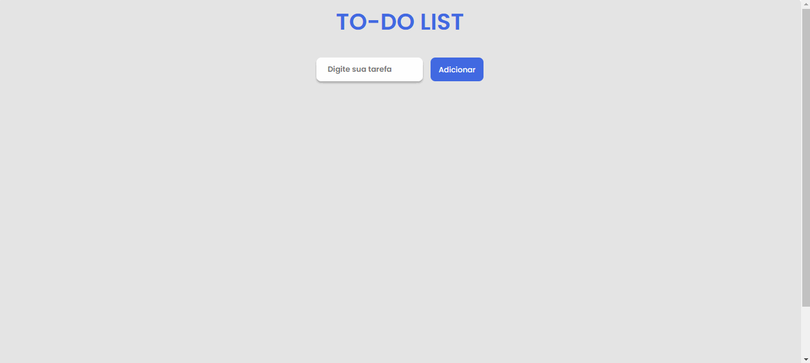

# Lista de Tarefas

> Projeto finalizado 

 

## 💻 Sobre o Projeto

Este projeto trata-se de uma lista de tarefas totalmente funcional para seu dia a dia! incluindo tarefas pedentes e adicionando um "checked" em suas tarefas realizadas. Foi utilizado React para o desenvolvimento deste projeto.

## 🔧Ajustes e melhorias
O projeto ainda está em desenvolvimento!

- [X] Armazenar a lista no localStorage
- [X] Adicionar percentual de tarefas concluídas
- [X] Adicionar modo escuro
 

## 👨‍💻Link para acesso: 
<a href="https://app-organizer-list.netlify.app/" target="_blank">Aperte aqui ⬅ </a>

## ☕ tecnologias utilizadas

 

## 💙 Colaborador

<table>
  <tr>
    <td align="center">
      <a href="#">
         
        
          <a >Matheus Juvenal</a>
        
      </a>
    </td>
  </tr>
</table>

  

 

[⬆ Voltar ao topo](#Lista-de-Tarefas) 